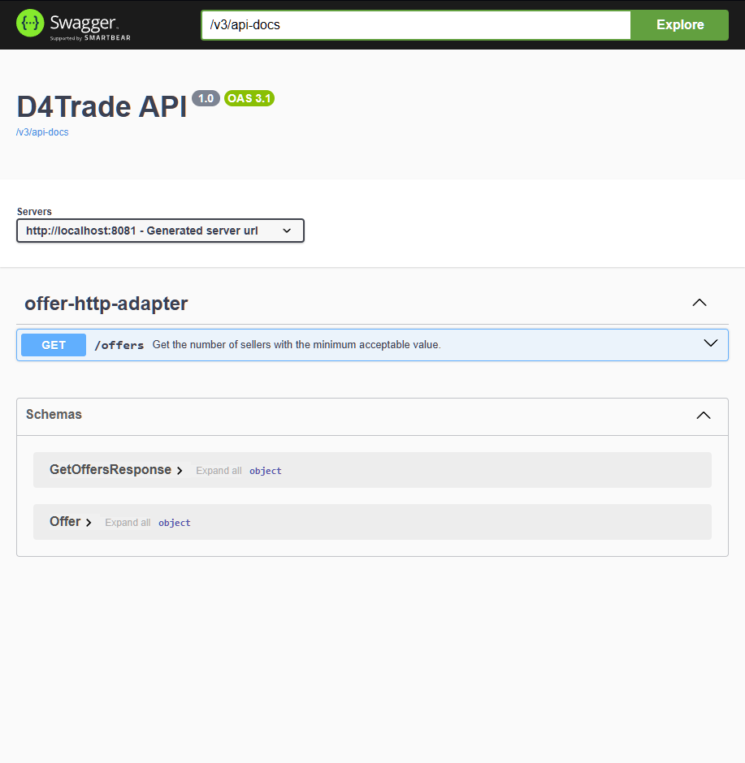

# D4 Auctioneer API

Hey guys!
I created that API to optimize our search in the diablo.trade site.
Using it we can find the best runes that are low on offers to sell.


## 🛠️ Installation via Docker

###### Minimum prerequisites

* Have [Docker installed](https://www.docker.com)


## 🛠️ Running via Docker

Open your terminal, navigate to the project's root folder, and run the following command:

```bash
$ docker-compose up
```

###### Java Requirements

* Java 21 ([Linux](https://www.rosehosting.com/blog/how-to-install-java-21-on-ubuntu-24-04/) or [Mac](https://medium.com/@aniketvishal/how-to-install-java-and-setup-java-home-path-in-macos-apple-silicon-m1-m2-2edf185b992c))
* Maven 3.9.9 ([download](https://archive.apache.org/dist/maven/maven-3/3.6.9/binaries/)/[configuration](https://www.baeldung.com/install-maven-on-windows-linux-mac))


## 🛠️ Running without Docker

Open another terminal, navigate to the project's root folder, and run the following commands:

```bash
mvn package -Dmaven.test.skip
```
```bash
java -Dspring.profiles.active=default -jar d4auctioneer-api.jar
```


## 🛠️ Documentation

With the application running, open your browser and go to [http://localhost:8080/swagger-ui/index.html](http://localhost:8080/swagger-ui/index.html) (or port 3000 via Docker) to access the Swagger interface, where the API endpoints and their functionality are listed:




## Offers

To find out which runes are in low offers, you can access the [offers endpoint](http://localhost:8080/offers?pageNumber=1&seasonType=softcore&transactionType=selling&runeNames=Ahu,Bac,Yul&minAcceptableValue=1000000&desirableValue=100000000) which already contains some parameters as example:


Note: x-d4trade-token is a header's parameter and its value is just a example (not valid). You have to obtain your own value:

```
x-d4trade-token: <DIABLO_TRADE_TOKEN>
```

The token can be obtained after logging into the diablo.trade site. Once logged in, press CTRL+SHIFT+I in your browser, open the "Application" tab, and in the left-hand menu, select "Storage > Cookies > https://diablo.trade". A new panel will open on the right side where you can copy the values (the red blurs in the image) for "__Secure-next-auth.session-token" and "cf_clearance".


With these two values in hand, combine them separated by a semicolon like this: "__Secure-next-auth.session-token=<your_token>; cf_clearance=<your_cf>"

Example:
```
x-d4trade-token: __Secure-next-auth.session-token=123; cf_clearance=456
```

## 📚 More information about the project

Frontend in development...